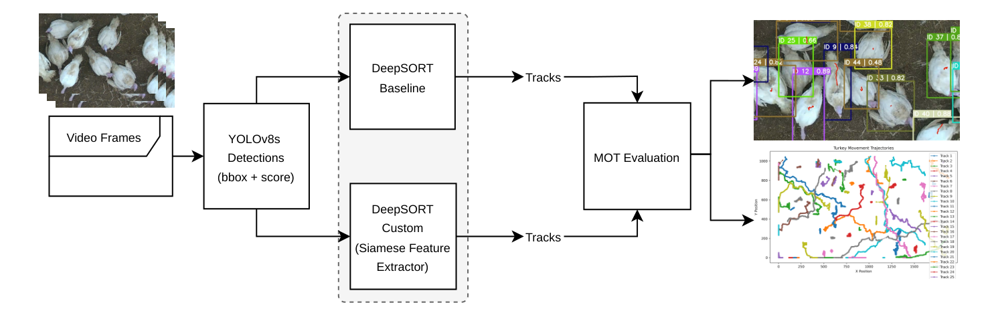
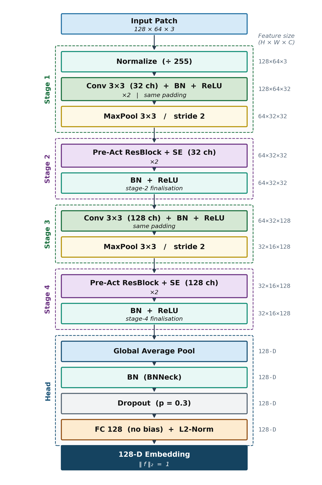
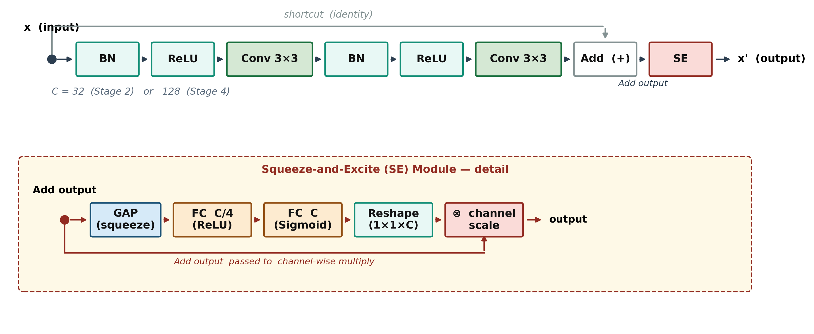
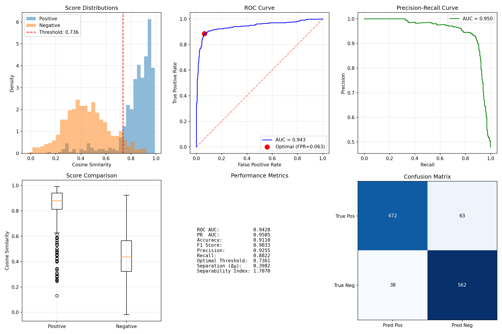
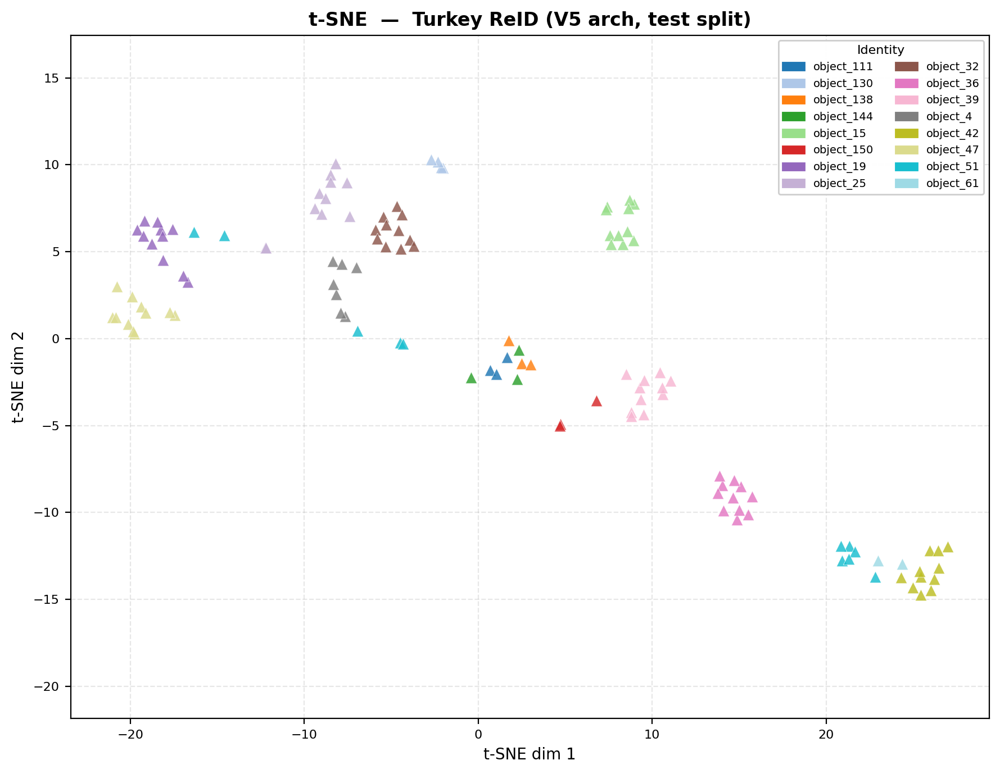
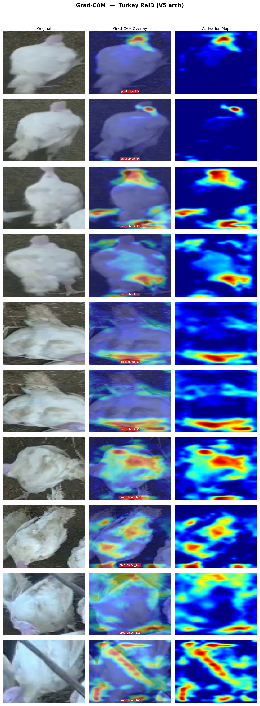

# Turkey Re-Identification: A Lightweight Domain-Specific Appearance Embedding for DeepSORT

> **Paper status:** *A Lightweight Domain-Specific Appearance Embedding for Turkey Re-Identification in Dense Barn Environments* — Debayan Sen, Theo Lutz (Hochschule Offenburg) — currently under revision and being prepared for submission.

---

## Overview

Multi-object trackers like DeepSORT rely on appearance embeddings to keep identities consistent across frames. The default embedding — `mars-small128`, a 2.8M-parameter network trained on pedestrian re-identification data — transfers poorly to poultry, where animals lack the clothing, texture, and body-structure cues that drive human re-ID.

This repository presents a **lightweight, domain-specific Siamese feature extractor** trained on turkey data. The final model (V5) has only **714K parameters** (3.9× fewer than mars-small128), improves ROC AUC from 0.890 to **0.943**, and raises distribution separability by **50%**, while fitting comfortably on resource-constrained edge hardware. It is a drop-in replacement for the mars-small128 `.pb` inside DeepSORT — no changes to the inference pipeline are needed.

---

## Key Results at a Glance

| | DeepSORT-Custom (V5) | DeepSORT-Baseline (mars-small128) |
|---|---|---|
| **Parameters** | 714K | 2.8M |
| **Model size** | 2.80 MiB | 10.72 MiB |
| **Inference latency** | 2.32 ± 0.36 ms | 2.52 ± 0.68 ms |
| **ROC AUC** | **0.9428** | 0.8902 |
| **Accuracy** | **0.9110** | 0.8485 |
| **Separability index** | **1.71** | 1.14 |
| **IDF1 (tracking, mean)** | **83.2%** | 81.3% |

---

## Architecture

The backbone is a compact four-stage CNN producing 128-D L2-normalised embeddings, designed through a systematic ablation study. Three design decisions differentiate the final model from the V1 baseline:

1. **Pre-activation residual blocks** (BN–ReLU–Conv–BN–ReLU–Conv–Add) — improves gradient flow by keeping the skip connection free of non-linear transformations.
2. **Squeeze-and-Excitation (SE) channel attention** — appended to every residual block; recalibrates channels toward discriminative cues such as plumage coloration and body markings.
3. **Stage-4 channel expansion (64 → 128)** — the most impactful change; places representational capacity in the deepest stage so global average pooling produces a 128-D descriptor directly.

```
Input (128 × 64 × 3, raw BGR [0, 255])
  ÷ 255 normalisation (in-model Lambda layer)
  Stage 1:  Conv(32) → BN → ReLU → Conv(32) → BN → ReLU → MaxPool
  Stage 2:  PreActResBlock(32) + SE  ×2
  Stage 3:  Conv(64) → BN → ReLU → MaxPool
  Stage 4:  PreActResBlock(128) + SE  ×2
  BNNeck → GlobalAveragePool → Dropout(0.3) → Dense(128) → L2Norm
Output: 128-D L2-normalised embedding  ("features:0")
```

Normalisation is embedded inside the model so the frozen `.pb` file accepts raw BGR `[0, 255]` patches directly — fully compatible with the standard DeepSORT inference pipeline.

### System overview

Video frames are processed by a shared YOLOv8s detector. Detections feed DeepSORT using either the baseline mars-small128 model or the proposed domain-specific Siamese extractor; holding detection fixed isolates the effect of the appearance embedding.



### Architecture diagram





---

## Ablation Study

Each variant adds one design element to the previous. All variants were trained under identical settings and evaluated on 16 **held-out, never-seen** test identities.

### Retrieval accuracy

| Model | Params | Change added | Rank-1 | Rank-5 | Rank-10 | mAP |
|---|---|---|---|---|---|---|
| mars-small128 | 2.8M | Reference baseline | 0.887 | 0.984 | 0.992 | 0.807 |
| V1 | 233K | Small four-stage CNN | 0.847 | 0.960 | 0.976 | 0.798 |
| V2 | 234K | + pre-activation + BNNeck | 0.895 | 0.968 | 0.968 | 0.817 |
| V3 | 235K | + SE channel attention | 0.879 | 0.960 | 0.976 | 0.815 |
| V4 | 243K | + strip pooling | 0.903 | 0.960 | 0.968 | 0.827 |
| **V5 (final)** | **714K** | **+ Stage-4 64→128 capacity** | **0.903** | **0.976** | **0.984** | **0.863** |

> V5 matches the 2.8M-parameter baseline on Rank-1 and surpasses it on mAP with 3.9× fewer parameters.

### Training stability

Selection of the final model was based on *reliability*, not just peak accuracy. V5 attains the highest post-warmup floor and the lowest standard deviation — meaning it is consistently accurate, not just occasionally accurate.

| Model | Best val Rank-1 | At epoch | Std (epoch ≥ 20) | Floor (epoch ≥ 20) |
|---|---|---|---|---|
| V1 | 0.931 | 26 | — | 0.873 |
| V2 | 0.941 | 22 | — | 0.873 |
| V3 | 0.961 | 30 | 0.021 | 0.863 |
| V4 | 0.941 | 28 | 0.018 | 0.873 |
| **V5 (final)** | **0.961** | **56** | **0.014** | **0.912** |

---

## Embedding Quality vs. Baseline

Evaluated on an exhaustive pairwise protocol over the 16 held-out test identities (535 positive pairs, 600 negative pairs):

| Metric | V5 (proposed) | mars-small128 | Improvement |
|---|---|---|---|
| ROC AUC | 0.9428 | 0.8902 | +5.9% |
| PR AUC | 0.9505 | 0.9064 | +4.9% |
| Accuracy | 0.9110 | 0.8485 | +7.4% |
| F1 Score | 0.9033 | 0.8320 | +8.6% |
| Precision | 0.9255 | 0.8712 | +6.2% |
| Recall | 0.8822 | 0.7963 | +10.8% |
| Separation Δμ | 0.3982 | 0.2295 | **+73.5%** |
| Separability index | 1.7070 | 1.1375 | **+50.1%** |
| Optimal threshold | 0.7361 | 0.7876 | — |

The most important metric for tracking is the separability index: when negative-pair similarities sit far below positive-pair similarities, the tracker recovers identities after occlusion far more reliably.

### Evaluation panels

**Proposed V5 model** — score distributions, ROC curve, PR curve, box plots, and confusion matrix (threshold = 0.736):



**Baseline mars-small128** — same panels for comparison (threshold = 0.788). The negative-pair distribution sits substantially higher and overlaps the positive distribution:


---

## Visualizations

### t-SNE — Proposed V5 embedding (test identities)



Each marker is one image patch; colours denote ground-truth identity. Most identities form tight, well-separated clusters. Residual overlap in the central region corresponds to genuinely visually similar individuals — not a failure of the model, but the intrinsic limit of visual homogeneity.

### Grad-CAM — Proposed V5 embedding



Activation concentrates on the bird's body (head–neck junction and upper back for standing birds; breast and flank for resting birds) while the litter background is suppressed. Identity is inferred from broad plumage texture and body posture — consistent with the SE attention design.

---

## Downstream Tracking Results

The V5 embedding was integrated into DeepSORT and evaluated on three commercial turkey-barn video sequences.

### MOT metrics

| Tracker / Sequence | IDF1 ↑ | MOTA ↑ | IDsw ↓ |
|---|---|---|---|
| DeepSORT-Custom — Seq 1 | 82.2% | 84.2% | 83 |
| DeepSORT-Custom — Seq 2 | 81.8% | 75.1% | 39 |
| DeepSORT-Custom — Seq 3 | 85.7% | 86.1% | 17 |
| **DeepSORT-Custom — Mean** | **83.2%** | **81.8%** | **46.3** |
| DeepSORT-Baseline — Seq 1 | 81.0% | 84.2% | 76 |
| DeepSORT-Baseline — Seq 2 | 79.8% | 75.0% | 39 |
| DeepSORT-Baseline — Seq 3 | 83.0% | 86.1% | 21 |
| DeepSORT-Baseline — Mean | 81.3% | 81.8% | 45.3 |

### HOTA decomposition

| Tracker / Sequence | HOTA | DetA | AssA | LocA | IDs used | GT IDs |
|---|---|---|---|---|---|---|
| Custom — Seq 1 | 64.6% | 64.1% | 66.1% | 80.7% | 123 | 62 |
| Custom — Seq 2 | 66.8% | 60.7% | 74.4% | 84.6% | 87 | 63 |
| Custom — Seq 3 | 70.7% | 69.3% | 73.0% | 84.8% | 61 | 45 |
| **Custom — Combined** | **66.3%** | **64.1%** | **69.9%** | **82.3%** | **90.3** | **56.7** |
| Baseline — Seq 1 | 64.3% | 64.2% | 65.3% | 80.8% | 139 | 62 |
| Baseline — Seq 2 | 66.0% | 60.5% | 72.8% | 84.5% | 103 | 63 |
| Baseline — Seq 3 | 70.0% | 69.3% | 71.7% | 84.8% | 69 | 45 |
| Baseline — Combined | 65.8% | 64.1% | 68.8% | 82.3% | 103.7 | 56.7 |

The proposed embedding reduces identity proliferation (90.3 vs. 103.7 IDs used for the same 56.7 ground-truth IDs), meaning more identities are successfully recovered after short interruptions rather than fragmented into new tracks.

---

## Dataset

A custom dataset was collected from commercial turkey-barn environments:

| Split | Identities | Images |
|---|---|---|
| Train | 74 | 483 |
| Val | 16 | 102 |
| Test | 16 | 124 |
| **Total** | **106** | **709** |

The split is at the **identity level** (all patches of an individual are assigned wholly to one split), making this an **open-set** evaluation: the model never sees val/test identities during training.

---

## Repository Structure

```
scripts/
  dataset.py          Dataset loading, identity split, PKSampler
  model.py            V1 — original DeepSORT-style CNN (223K params)
  model_v2.py         V2 — pre-activation residual blocks + BNNeck
  model_v3.py         V3 — V2 + SE channel attention
  model_v4.py         V4 — V3 + horizontal strip pooling
  model_v5.py         V5 — V2 + Stage-4 64→128 + SE  ← final model
  losses.py           Batch-hard / batch-soft triplet loss (Hermans 2017)
  augmentation.py     ReID augmentation pipeline
  metrics.py          CMC / mAP / rank-k evaluation
  train_reid.py       Training entry point (V1 baseline)
  train_reid_v2.py    Multi-arch training script (--arch v2..v5)
  eval_reid.py        Evaluation with CMC / mAP
  export_pb.py        Export Keras weights → frozen .pb
  sanity_check.py     Quick .pb inference + triplet sanity check
  visualize_tsne.py   t-SNE visualization
  gradcam_reid.py     Grad-CAM activation maps
deep_sort/            DeepSORT tracking pipeline (patched for .pb compatibility)
```

---

## Setup

```bash
conda create -n mot python=3.7
conda activate mot
pip install -r requirements.txt
```

Recommended: TensorFlow 2.11.0, OpenCV 4.10.

---

## Training

```bash
# V5 (final model)
conda run -n mot python scripts/train_reid_v2.py \
    --arch v5 \
    --dataset_path dataset_siam_21 \
    --epochs 200 --patience 25 \
    --P 16 --K 4 \
    --lr 3e-4 --weight_decay 2e-4 --dropout 0.3 \
    --seed 42
```

**Key training flags:**

| Flag | Default | Description |
|---|---|---|
| `--arch` | `v5` | Architecture variant (`v1`–`v5`) |
| `--P` | 16 | Identities per PK batch |
| `--K` | 4 | Images per identity → batch size = P×K |
| `--lr` | 3e-4 | Adam learning rate |
| `--margin` | 0.5 | Triplet loss margin (soft-plus formulation) |
| `--loss_type` | `soft` | `soft` (soft-plus) or `hard` |
| `--id_loss_weight` | 0.5 | λ weighting for the ID classification head |
| `--epochs` | 200 | Maximum epochs |
| `--patience` | 25 | Early-stopping patience (on val Rank-1) |
| `--seed` | 42 | Random seed for reproducible split |

---

## Evaluation

```bash
# CMC + mAP on test split
conda run -n mot python scripts/eval_reid.py \
    --weights  runs/turkey_reid_v5/best_model_keras.h5 \
    --manifest runs/turkey_reid_v5/split_manifest.json

# Cross-split: query=test, gallery=train+val
conda run -n mot python scripts/eval_reid.py \
    --weights  runs/turkey_reid_v5/best_model_keras.h5 \
    --manifest runs/turkey_reid_v5/split_manifest.json \
    --query_split test --gallery_splits train val
```

---

## Export and Integration into DeepSORT

```bash
# 1. Export to frozen .pb
conda run -n mot python scripts/export_pb.py \
    --weights runs/turkey_reid_v5/best_model_keras.h5 \
    --output  runs/turkey_reid_v5/best_model.pb

# 2. Sanity check (same-ID similarity > diff-ID similarity)
conda run -n mot python scripts/sanity_check.py \
    --pb_path runs/turkey_reid_v5/best_model.pb \
    --image1  dataset_siam_21/object_1/frame_100.jpg \
    --image2  dataset_siam_21/object_1/frame_200.jpg \
    --image3  dataset_siam_21/object_2/frame_100.jpg
```

Then in `tracker.py`, change one line:

```python
# Before
encoder_model_filename = 'model_feature_extractor/mars-small128.pb'
# After
encoder_model_filename = 'runs/turkey_reid_v5/best_model.pb'
```

> **Note:** `deep_sort/tools/generate_detections.py` has been patched to use `name=""` when importing the frozen graph (instead of `name="net"`), so the tensor names `images:0` and `features:0` resolve correctly. No other DeepSORT changes are needed.

---

## Acknowledgements

This work was supported by the Federal Ministry of Agriculture, Food and Regional Identity (BMLEH) based on a resolution of the German Bundestag under the **KINLI project** (Grant No. 28DK124D20).

The authors thank Christopher Pack Ingo (Fraunhofer FIT) for project coordination and data access; Kolsert KG for domain expertise and data contribution; Tim Zeiser for technical support; and Eva Riedel (Hochschule Niederrhein) for video dataset annotation.
